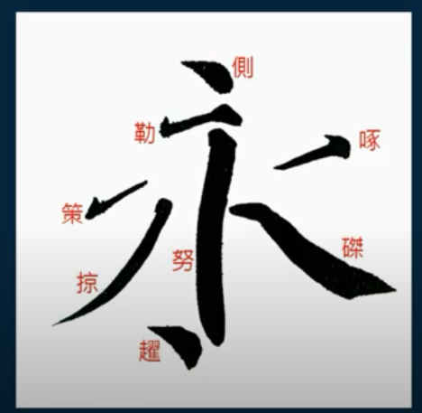

# 书法

## 书法三要素

> 《玉堂禁经》
>
> 唐·张怀瓘
>
> 夫书第一用笔，第二识势，第三裹束。三者兼备，然后为书；苟守一途，即为未得。

## 1 用笔

用筆 = 執筆﹝五執筆﹞ + 用鋒﹝九用﹞

用笔也被称为——小圈

### 1.1 执笔（五执笔）

1. 执管（书法使用）
2. 扌族（cu2，但念成了zu2）管
3. 撮管
4. 握管
5. 搦管

### 1.2 用锋（九用）

1. 顿笔
2. **挫笔**
3. 驭锋
4. 蹲锋
5. 足存（cun）锋
6. 扭锋
7. **趯锋**
8. 按锋
9. 揭笔

2和7是书写动作，其他是调锋动作

## 2 识势

識勢 = 單一筆勢﹝永字八法﹞ + 複合筆勢﹝五勢﹞

笔锋的走势——大圈

### 2.1 永字八法

### 2.2 五势

1. 曲尺势（横画加竖画，横折）
2. 交争势（撇加捺）
3. 飞带势（两撇一捺）
4. 顾盼势（小）

## 3 裹束

裹束就是小圈加大圈

